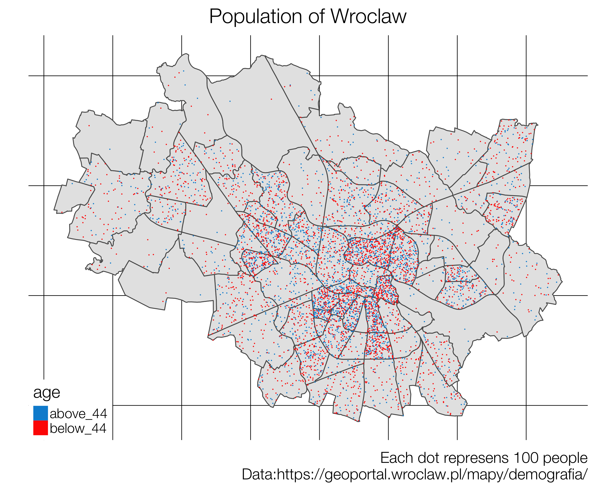

  
# Introduction
  
## One of our goals
  
```{r motivation_plot, echo = FALSE, out.width = "700px, fig.align='center'"}

```

## Slides, notes and data

- Available on github
- https://github.com/psobczyk/whyR_2018_workshop

```{r qr_github, echo = FALSE, out.width = "500px, fig.align='center'"}

```

## Prerequisites

> - Basic ggplot
> - Basic dplyr
> - Enthusiasm :)

## Packages you need

```{r installing_packages}
packages_required <- c('dplyr', 'tidyr', 'sf', 'ggplot2', 'ggmap',
                       'ggthemes', 'animation', 'leaflet', 'rnaturalearth')
packages_to_install <- packages_required[!packages_required %in% installed.packages()[,"Package"]]
if(length(packages_to_install) > 0)
  install.packages(packages_to_install)
```

##

```{r loading_packages, message=FALSE, warning=F}
suppressPackageStartupMessages(library(dplyr))
library(tidyr)
library(ggmap)
library(ggthemes)
library(sf)
library(animation)
library(leaflet)
library(rnaturalearth)
```

## Ready for a ride?

# ggmap

## getting map snapshot

```{r, echo=FALSE, include=FALSE}
load('data/ggmap_examples.Rdata')
```


```{r, eval=FALSE}
wroclaw_map <- get_map(location = 'Wroclaw', zoom = 11, language = 'en') 
ggmap(wroclaw_map)
```

```{r, echo=FALSE}
ggmap(wroclaw_map)
```

## getting coordinates

```{r, eval=FALSE}
hotel_scandic <- ggmap::geocode(location = 'Hotel Scandic Wroclaw')
str(hotel_scandic)
```
```{r, echo=FALSE}
str(hotel_scandic)
```

## combining what we've learned so far

```{r}
ggmap(wroclaw_map) +
  geom_point(data = hotel_scandic, aes(x = lon, y = lat), 
             size = 5, color = 'red')
```

## reverse geocoding

```{r, eval=FALSE}
mysterious_location <- ggmap::revgeocode(location = c(13.43775,	52.49651))
```

> * `r mysterious_location`

## API limits

```{r}
geocodeQueryCheck()
```

## too frequent queries

```{r, eval=F}
locations <- c('Wroclaw', 'Poznan',' Warszawa')
loc_df <- 
  data.frame(name = locations, 
             geocode(location = locations),
             stringsAsFactors = F)
```

## 

```{r, eval=FALSE}
lapply(locations, function(loc){
  Sys.sleep(3)
  ggmap::geocode(loc)
}) %>%
  do.call(what = rbind)
```

##

```{r, eval=F}
poland_map <- get_map(location = 'Poland', 6, 
                      language = 'en', color = 'bw') 
ggmap(poland_map) +
  geom_point(data = loc_df, aes(x = lon, y = lat), 
             size = 5, color = 'red')
```

```{r, echo=FALSE}
ggmap(poland_map) +
  geom_point(data = loc_df, aes(x = lon, y = lat), size = 5, color = 'red')
```


# Excercises set 1

## Getting data

> - Go to https://jumpingrivers.github.io/meetingsR/the-data.html and get csv file with list of all R Users Groups and try geolocating
R users group that is closes to where you live.
> - Go to my github https://github.com/psobczyk/whyR_2018_workshop and get csv file with groups info AND prepared file with precomputed geolocations
> - Get world map using ggmap package
> - Plot all the R Users Groups around the world

## Hint before you start

```{r load_r_groups}
print(load(file = 'data/r_groups_geolocated.Rdata'))
```

##

```{r warning=FALSE}
ggmap(emea) +
  geom_point(data=cities_location, aes(x=lon, y=lat), alpha=0.8)
```

## Solution code

```{r, eval=FALSE}
r_groups <- read.csv('data/groups.csv', stringsAsFactors = F)
cities_to_geolocate <- unique(paste(r_groups$city, 
                                    r_groups$country, sep = ', '))
cities_location <- ggmap::geocode(cities_to_geolocate)
cities_location <- data.frame(cities_location, 
                              cities_to_geolocate, stringsAsFactors = F)
while(any(is.na(cities_location$lon))){
	cities_to_geolocate <- cities_location$cities_to_geolocate[is.na(cities_location$lon)]
	print(sprintf('%s cities left', length(cities_to_geolocate)))
	missing <- ggmap::geocode(cities_to_geolocate)
	cities_location <- cities_location %>%
		filter(!is.na(lon)) %>%
		rbind(data.frame(missing, cities_to_geolocate, stringsAsFactors = F))
}

emea <- get_map(location = c(10,22), zoom = 3)
america <- get_map(location = c(-90,5), zoom = 3)
asia <- get_map(location = c(105, 10), zoom = 3)