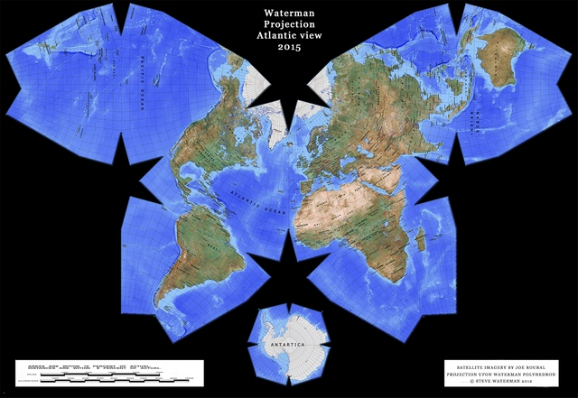
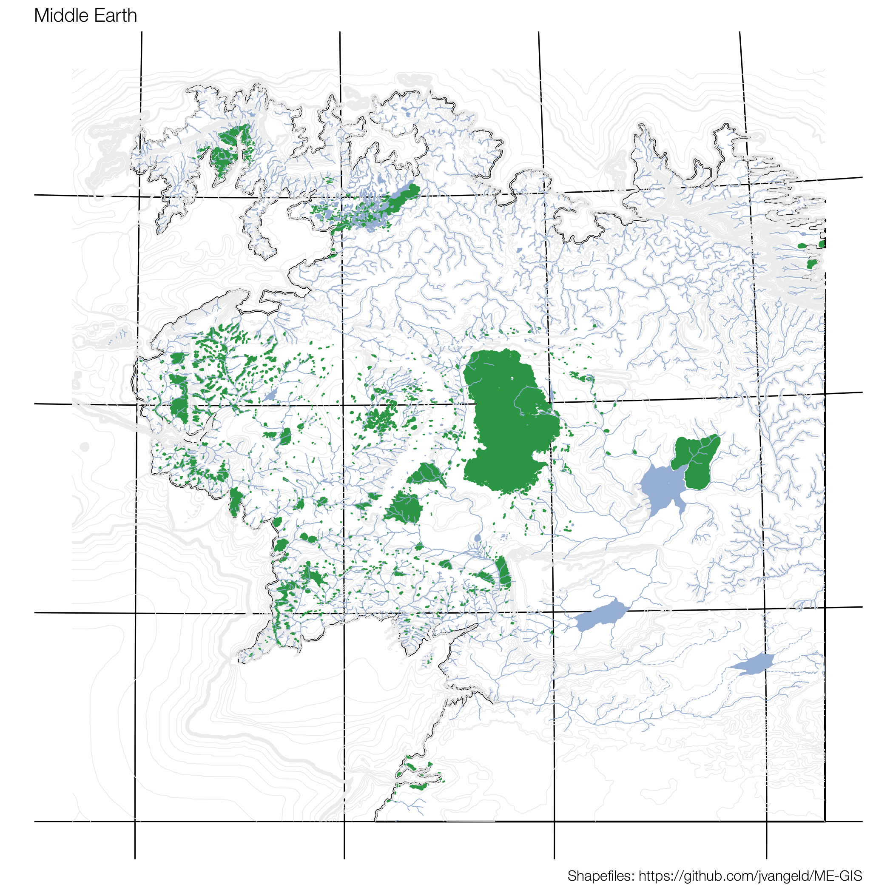

```{r loading_packages, echo=FALSE, message=FALSE, warning=F}
suppressPackageStartupMessages(library(dplyr))
library(tidyr)
library(ggmap)
library(ggthemes)
library(sf)
library(animation)
library(leaflet)
library(rnaturalearth)
```

# What you need to know about geography

## What is a map and why having flat earth would make our lifes easier

> - map is a mathemtical image of a space that projects objects and geografical phenomena in *scale* and 
rectangular *projection*
> - set of cartographical signs with a purpose to show geographical objects and phenomena 
> - reflects reality in a **specificely  generalized way** – could be treated as a model for a reality

## Good old Mercator

Angles are right. That is why it is used by sailors :)

```{r WorldMercator, echo = FALSE, out.width = "650px", fig.align='center'}
knitr::include_graphics("figures/Mercator_projection_SW.jpg")
```


## Gall–Peters projection

Area proportions are right.

```{r WorldGallPeters, echo = FALSE, out.width = "700px, fig.align='center'"}
knitr::include_graphics("figures/Gall–Peters_projection_SW.jpg")
```


## Robinson projection

Always not accurate, but in acceptable way. That's why UN uses it :)

```{r WorldRobinson, echo = FALSE, out.width = "700px, fig.align='center'"}
knitr::include_graphics("figures/Robinson_projection_SW.jpg")
```

## Waterman Butterfly Map 

```{r WatermanButterfly, echo = FALSE, out.width = "700px, fig.align='center'"}

```

# Reading shapefiles

## What is a shapefile?

> - File that stores areas boundaries
> - Usually stored in special files, *.shp* or *.gjson*. 
> - Can be loaded to R using, among others, *sf* or *rgdal* packages
> - Some are available online for free

##

```{r}
districts_wroclaw <- sf::read_sf('data/districts_wroclaw/districts_wroclaw.shp', 
                                 options = "ENCODING=UTF-8")
class(districts_wroclaw)
head(districts_wroclaw)
```

##

```{r}
plot(districts_wroclaw)
```

## Spatial objects

> - Spatial polygons (what we just saw)
> - Spatial points
> - Spatial linestring
> - Their combinations

##

```{r}
st_point(c(5, 2)) # XY point
```

```{r}
polygon_list = list(rbind(c(1, 5), c(2, 2), c(4, 1), c(4, 4), c(1, 5)))
st_polygon(polygon_list)
```

```{r}
gemetrycollection_list = list(st_point(c(5, 2)),
                              st_polygon(polygon_list))
st_geometrycollection(gemetrycollection_list)
```

##

```{r}
plot(st_geometrycollection(gemetrycollection_list)) 
```

## On those object one can perform a lot of operations

- st_intersects: touch or overlap
- st_disjoint: !intersects
- st_touches: touch
- st_crosses: cross (don’t touch)
- st_within: within
- st_contains: contains
- st_overlaps: overlaps
- st_covers: cover
- st_covered_by: covered by
- st_equals: equals
- st_equals_exact: equals, with some fuzz

## Geometry generating logical operators

- st_union: union of several geometries
- st_intersection: intersection of pairs of geometries
- st_difference: difference between pairs of geometries
- st_sym_difference: symmetric difference (xor)

# ggplot

## Using ggplot with sf objects

```{r}
ggplot() + 
  geom_sf(data = districts_wroclaw, aes(fill = inhbtnt), color='white') + 
  scale_fill_gradient(low = "white", high = "red")
```

## Real estates example

> - Data scraped from one the leading real estate website in Poland
> - If you're intersted in tools - **rvest** package and *xpath* queries
> - 5000 listings with geolocation
> - size, no rooms, etc

##

```{r}
print(load('data/real_estate_listings.Rds'))
head(real_estate_listings)
```

## Transforming into **sf** object

```{r}
real_estate_listings_sp <- st_as_sf(real_estate_listings, coords = c("lon", "lat"), crs = 4326)
summary(real_estate_listings)
```

## What the hell is crs?

> - Coordinate reference system
> - Every projection is different reference system
> - CRS 4326 is WGS84 - Mercator (this what you get from google maps)
> - You can switch between different reference systems **sf::st_transform()**

## Plotting is again super simple

```{r}
ggplot() + 
  geom_sf(data = districts_wroclaw, aes(fill = inhbtnt), color='white') + 
  geom_sf(data = real_estate_listings_sp, inherit.aes = FALSE, alpha = 0.05) +
  scale_fill_gradient(low = "white", high = "red") 
```


## There are some points outisde city limits - we shall remove them.

```{r}
listings_within_city_limits <- st_within(x = real_estate_listings_sp, y = districts_wroclaw)
listings_within_city_limits <- sapply(listings_within_city_limits, function(x) length(x) > 0)
```

## ggthemes

- Maps are different than normal plots - use theme that reflects that

```{r, eval=FALSE}
ggplot() + 
  geom_sf(data = districts_wroclaw, aes(fill = inhbtnt), color='white') + 
  geom_sf(data = real_estate_listings_sp[listings_within_city_limits,], inherit.aes = FALSE, alpha = 0.05) +
  scale_fill_gradient(low = "white", high = "red")+
  ggthemes::theme_map() +
  theme(plot.background = element_rect(fill = 'gray95'),
        panel.grid = element_line(colour=FALSE))
```

##

```{r, echo=FALSE}
ggplot() + 
  geom_sf(data = districts_wroclaw, aes(fill = inhbtnt), color='white') + 
  geom_sf(data = real_estate_listings_sp[listings_within_city_limits,], inherit.aes = FALSE, alpha = 0.05) +
  scale_fill_gradient(low = "white", high = "red")+
  ggthemes::theme_map() +
  theme(plot.background = element_rect(fill = 'gray95'),
        panel.grid = element_line(colour=FALSE))
```

# More about shapefiles

## Were do I find them?

* **maps** package in R
* [Natural earth](www.naturalearthdata.com) - world map, different scales, R package *rnaturalearth*
* [Eurostat](http://ec.europa.eu/eurostat/web/gisco/geodata/reference-data/administrative-units-statistical-units/nuts) - NUTS 1,2,3 
* [GUS](https://geo.stat.gov.pl/inspire) - for Poland. 
* Other open source
* [Walhkreiseinteilung](https://www.bundeswahlleiter.de/bundestagswahlen/2017/wahlkreiseinteilung/downloads.html)
* [Verwaltungsgemeinschaftsgrenzen](http://data-odiqueensland.opendata.arcgis.com/datasets/402ee65bfe17473692132e0c7808d89d_0)

## Bonus before a break

```{r, eval=FALSE}
coastline <-  sf::read_sf('data/ME-GIS-master/Coastline2.shp')
forests <-  sf::read_sf('data/ME-GIS-master/Forests.shp')
lakes <-  sf::read_sf('data/ME-GIS-master/Lakes2.shp')
rivers <-  sf::read_sf('data/ME-GIS-master/Rivers19.shp')
contours <-  sf::read_sf('data/ME-GIS-master/Contours_18.shp')

p <- ggplot() +
  geom_sf(data = coastline, color = 'black') +
  geom_sf(data = contours, color = '#f0f0f0', fill='#f0f0f0', size = .2) +
  geom_sf(data = forests, color = '#31a354', fill='#31a354', size = .2) +
  geom_sf(data = lakes, color = '#a6bddb', fill='#a6bddb', size = .2) +
  geom_sf(data = rivers, color = '#a6bddb', size = .2) +
  labs(caption = 'Shapefiles: https://github.com/jvangeld/ME-GIS') +
  ggthemes::theme_map(base_family = 'Helvetica Neue Light')

ggsave('filename.png', p)
```

## 

```{r MiddleEarth, echo = FALSE, out.width = "700px, fig.align='center'"}

```

# Excercise

- Get data on listings from my github https://github.com/psobczyk/whyR_2018_workshop/blob/master/data/real_estate_listings.Rds
- Compute average price of real estates in each district
- Create (your first) choreopleth

## Excercise solution

```{r}

```


# Open Street Maps

## 

> - You can download data for free https://download.bbbike.org/osm/bbbike/Wroclaw/
> - For our convinience https://github.com/psobczyk/whyR_2018_workshop/tree/master/data/Wroclaw-shp
> - We shall add trams and rivers from open street map to our choreopleth


## Getting the data

```{r}
railways <- sf::read_sf("data/Wroclaw-shp/shape/railways.shp", stringsAsFactors = F)
trams <- railways %>%
  filter(type == 'tram')

rivers <- sf::read_sf("data/Wroclaw-shp/shape/waterways.shp", stringsAsFactors = F) %>%
  filter(name %in% c('Odra', 'Oława', 'Kanał Żeglugowy', 'Widawa', 'Ślęza'))

natural <- sf::read_sf("data/Wroclaw-shp/shape/natural.shp", stringsAsFactors = F) %>%
  filter(name != "")
```

## Plotting the data

```{r}
ggplot() + 
  geom_sf(data = districts_wroclaw, aes(fill = inhbtnt), color='white') + 
  geom_sf(data = trams) +
  geom_sf(data = rivers, color = 'lightblue') +
  scale_fill_gradient(low = "white", high = "red") +
  ggthemes::theme_map() +
  theme(plot.background = element_rect(fill = 'gray95'),
        panel.grid = element_line(colour=FALSE))
```

## Excercise

- Read info about parks from *natural.shp*
- Add it to the previous plot (choose adequate color)

## What we've learned

> - what is shapefile
> - what is coordinate reference system
> - how to load spatial data to R using **sf** package
> - what are data sources
